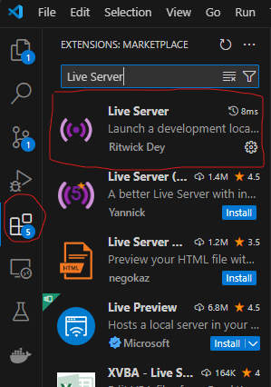

### I built upon a previously started project, I expanded the functionality of the captcha cracking bot greatly within my 8 week internship ###

# CAPTCHA Implementation with reCAPTCHA v2

In learning about the implemenation of CAPTCHA, the HTML file here uses reCAPTCHA v2 for simplicity sake. However, reCAPTCHA and hCAPTCHA, the most popular types of CAPTCHA services, implement their CAPTCHA services using a host name, domain name or IP address which means we can't simplfy run the HTML standalone since the CAPTCHA mechanism will break. The way I found to get around this is to launch a web server locally through the use of Visual Studio code extension named Live Server. 

## Requirements

1. **Visual Studio Code (VS Code)**
   - Install [Visual Studio Code](https://code.visualstudio.com/).
   - Install the **Live Server** extension from the VS Code Extensions Marketpalce (as shown in the screenshot below)

   
   
2. **Python**
   - Download the [installer](https://www.python.org/downloads/) for your operating system and run it. Make sure to check the box (on Windows installs) to add the interpreter to the path. 
   - Currently this project has been tested with **Python 3.10.15**

3. **Set the VS Code Python Interpreter**
   - Inside of VS Code, select `view->Command Pallette`
   - Search for: `Python:Select Interpreter`
   - Select the version of Python you installed from the list

## Setup Instructions
1. Open the `Captcha` (the folder that contains this README) in VS Code 
2. Select `Terminal->New Terminal`
3. Run the following command in the terminal: `pip install -r requirements.txt` 
   - This will install all of the Python libraries required to run the project
     
## Running the Project 
1. Open the `Captcha` folder in VS Code. The `Captcha` folder contains the README you are currently reading and the additional required files: 
   - a_captcha_screenshot.py
   - b_crop_image.py
   - c_read_captcha.py
   - d_object_detection.py
   - e_click_object.py
   - m_solve_captcha.py
   - Replit HTML file.html 
   - reference-image.png 
   -Optional: uah-logo.svg 
2. Start the local web server:
   - Right-click on `Replit HTML file.html` and select **"Open with Live Server"**.
   - This will launch a local web server at the address [http://127.0.0.1:5500/Captcha/Replit%20HTML%20file.html](http://127.0.0.1:5500/Captcha/Replit%20HTML%20file.html), allowing you to test the reCAPTCHA service.
3. Edit the driver.get() command:
   - If your web server is running at  [http://127.0.0.1:5500/Captcha/Replit%20HTML%20file.html](http://127.0.0.1:5500/Captcha/Replit%20HTML%20file.html), you should not have to edit the `driver.get()` function. 
   - If your web server is running at a different location or on a different port, copy the URL and replace the contents of the `driver.get()` function. 

## Run the entire project with

   `python m_solve_captcha.py` 

The captcha testing window will open, a screenshot will be taken of the captcha, it will then prompt for user input, the number of rows and the number of columns. You will also notice the "reload site" popup in the browser, this exists so that the captcha does not reset, just hit cancel, then wait 5 seconds until the script will attempt to click on the tiles. 

The `m_solve_captcha.py` file is a main file so for testing and getting used to the project, you can run all of its components one at a time. The rest of the README details exactly that. 

1. Run the a_captcha_screenshot.py file
   - Enter the command `python a_captcha_screenshot.py` in the terminal (Be sure you are still in the Captcha directory)
   - Running the first script will open a Chrome developer test window and will input information and take a screenshot of your screen with the CAPTCHA. BEWARE: If using another resolution or aspect ratio other then 1920X1080, the screenshot might be off and you will get an error, so take your own screenshot of the Captcha to use as reference-image.png.
   - There are two functions in this file, edgeLocate uses edge detection while templateLocate runs a template match. You can choose which to use at the bottom by calling one or the other, the templateLocate function works 100% of the time but the edgeLocate method has some issues, feel free to fix it. 

2. Run the b_crop_image.py
   - `a_captcha_screenshot.py` will create a `captcha-image.png` file in the `/captchas/` directory. All images are saved to this foldr. Once you see this file, you can proceed to running the second script. 
   - Enter the command `python b_crop_image.py` in the terminal to run the second script (Be sure you are still in the Captcha directory). 
   - This script crops the image into `captcha_top.png`: an image of the captcha text, detailing what the solver must click on, as well as the `cropped_image.png`: an image of just the image part of the captcha

3. Run read_captcha.py to get the object we are trying to detect from the captured captcha.
   - run `requirements.txt` to get the required packages with:
      `pip install -r requirements.txt`
   - Install the Tesseract OCR Engine
      MacOS: `brew install tesseract`
      Ubuntu: `sudo apt update`
              `sudo apt install tesseract-ocr`
      Windows: Download it here: https://github.com/tesseract-ocr/tesseract
      and add it to your system's PATH
   - Once it is installed, you can run read_captcha.py to get the object needed as a string

4. Running the Object Detection Script

There are some additional packages in the `requirements.txt` file that need to be installed. Before running the `d_object_detection.py` script with the instructions below, run the following command from the `Captcha` folder in the terminal: 
`pip install -r requirements.txt`

`object_detection.py` accepts the following command line arguments: 

- `--target`: The target class to detect (i.e. what the Captcha is asking you to click on)
- `--input`: The input image to process

If you inspect the script, the defaults are set to proces the `./example_images/traffic_lights.png` image and the target is set to `traffic light`. 

If you run the script with `python object_detection.py` without specifying the command line arguments, you should see the traffic light bounding boxes printed to the console and two OpenCV windows showing the original input image and the object detection results. 

If you specify command line arguments to change the target class and input image, you can tell the script what object to detect from the captcha. For example, to detect all buses in the `./example_images/bus1.png` image, run the following command from the terminal: 

`python object_detection.py --target bus --input ./example_images/bus1.png`

You should see the detection coordinates in the terminal window and the two OpenCV windows showing the original input image and the results. 

5. Running e_click_object.py
- This script contains two methods: 
   
   `click_on_center_of_box()`: This method clicks on the center of each detected bounding box found from the object detection script. This should be used when the captcha is a grid of different 9 or 16 different images. 
   
   `click_on_tiles()`: This method clicks on every tile inside a given bounding box. This should be used when the captcha is a grid of images making up one larger image.

## Additional Information
Note: The Google reCAPTCHA process can be explained [here](https://developers.google.com/recaptcha/docs/display). This is necassary to mention as the reCAPTCHA prompt is tied to a site / domain name which is tied to an account. Right now the currently made one is assigned to a temporary email which may stop working so to ensure the captcha still works, you can substitute your own account to make the reCAPACTHA prompt. The only thing of the code should be changed to tranfer ownership is to change line 112 of the HTML file, the 'data-sitekey' value to the value provided by your own account. The making of the widget is the same regardless of who makes it. You can view the Google Developer link for more information. 

Also to help familiarize yourself with Selenium, visit [the getting started docs](https://www.selenium.dev/documentation/webdriver/getting_started/). 
It may prompt you to import / download the webdriver for selenium and selenium webdriver manager so that it uses a testing version of Chrome instead of your own version of Chrome.  
